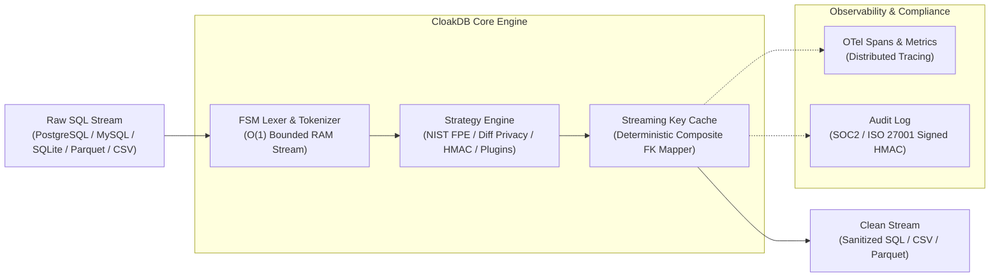

<div align="center">

# 🛡️ CloakDB

**High-throughput, dialect-agnostic database anonymization and differential privacy engine with Format-Preserving Encryption (FPE) and $\mathcal{O}(1)$ memory streaming.**

[](https://github.com/latryee/CloakDB/actions)
[](https://github.com/latryee/CloakDB)
[](https://pypi.org/project/cloakdb/)
[](https://pypi.org/project/cloakdb/)
[](https://opensource.org/licenses/Apache-2.0)
[](https://opentelemetry.io/)


<br/>

### ⚡ Quickstart

```bash
# 1. CLI Streaming (O(1) Bounded RAM on multi-gigabyte dumps)
cat input.sql | cloakdb mask -c config.yaml > clean.sql

# 2. Schema Linting & Drift Detection (CI/CD Quality Gate)
cloakdb lint -c config.yaml --schema schema.sql

# 3. SOC2 / ISO 27001 Cryptographic Audit Trail Verification
cloakdb audit-log --verify audit_trail.json -c config.yaml

# 4. Zero-Dependency Docker Execution
docker run --rm -i cloakdb/cloakdb mask < dump.sql > clean.sql
```

[Key Capabilities](#-key-capabilities) •
[Architecture & Dataflow](#-visual-architecture--dataflow) •
[Competitive Landscape](#-competitive-feature-matrix) •
[Benchmarks](#-benchmarks--performance) •
[Installation](#-installation) •
[CLI Command Reference](#-cli-command-reference) •
[Configuration Reference](#-configuration-reference-cloakdbyaml) •
[Plugin System](#-custom-strategy-plugin-system)

</div>

---

## 💡 Why CloakDB?

Creating realistic, relational staging environments and anonymized analytics pipelines from production data poses severe challenges:
1. **Broken Foreign Keys**: Naive randomization breaks referential integrity (`orders.customer_id` no longer links to `users.id`).
2. **Out-of-Memory Crashes**: Standard tools buffer entire multi-gigabyte dumps in RAM before writing.
3. **Strict Downstream Validation**: Services reject generated credit card numbers or national IDs that fail Luhn checks or checksum algorithms.
4. **Compliance Audit Deficits**: Modern SOC2, ISO 27001, and HIPAA audits mandate cryptographic proof, $(\epsilon, \delta)$ privacy budget enforcement, and immutable signed audit trails.

**CloakDB** solves all of these out-of-the-box:

- **$\mathcal{O}(1)$ RAM Streaming Parser**: Fully deterministic Finite-State Machine (FSM) tokenizer streaming PostgreSQL `COPY` (text & CSV modes), MySQL extended `INSERT ... VALUES (...) ON DUPLICATE KEY UPDATE`, SQLite, Parquet, CSV, and JSONL streams.
- **NIST-Standard Format-Preserving Encryption (FPE)**: AES-FF1 / FF3-1 Feistel networks encrypt structured PII (Credit Cards passing Luhn checks, Turkish TCKN, US SSN, Phone numbers, Emails) while preserving exact length, formatting, and character domains.
- **Formal $(\epsilon, \delta)$ Differential Privacy**: Built-in Laplace and Gaussian perturbation with sensitivity clamping and cumulative budget consumption tracking.
- **Deterministic Key Mapping**: Foreign keys and composite foreign keys remain synchronized across separate tables without unbounded RAM caching.
- **Enterprise Observability & Compliance**: Native OpenTelemetry distributed tracing, structured JSON logs, and HMAC-SHA256 tamper-evident SOC2 audit logs (`cloakdb audit-log`).
- **Automated Drift & PII Linting (`cloakdb lint`)**: Fails CI/CD pipelines when newly introduced production columns contain unmasked PII.

---

## 🏗️ Visual Architecture & Dataflow



---

## 📊 Competitive Feature Matrix

| Feature | `CloakDB` | `PostgreSQL Anonymizer (anon)` | `Benthos / Redpanda Connect` | `Custom Python Scripts` |
| :--- | :---: | :---: | :---: | :---: |
| **Memory Footprint on 10GB+ Dumps** | **Strict $\mathcal{O}(1)$ Bounded RAM** | In-Engine DB RAM overhead | Low to Medium | Unbounded (High OOM Risk) |
| **Dialect & Format Support** | **Postgres, MySQL, SQLite, Parquet, CSV, JSONL** | PostgreSQL only (In-Engine) | Generic stream / ETL | Fragmented / Ad-hoc |
| **Format-Preserving Encryption (FPE)** | **Built-in (NIST SP 800-38G FF1 / FF3-1)** | ❌ No | ❌ Plugin / Script needed | ❌ Rare / Complex |
| **Luhn / Checksum Preservation** | **Native (Credit Cards, SSN, TCKN)** | ❌ No | ❌ No | ❌ Manual coding |
| **Differential Privacy Budget Tracking $(\epsilon, \delta)$** | **Exact Budget Consumption & Clamping** | ❌ Basic noise | ❌ No | ❌ No |
| **OpenTelemetry Observability** | **Native Spans & OTLP Metrics** | ❌ PG Logs only | Native OTel | ❌ No |
| **Signed SOC2 / ISO 27001 Audit Trails** | **Native HMAC-SHA256 Signed JSON** | ❌ No | ❌ No | ❌ No |
| **Referential Integrity / Composite FKs** | **Automatic Multi-Table Mapping** | Supported (within single DB) | ❌ Complex state stores | ❌ Brittle SQLite caches |
| **Schema Drift & PII Linting** | **Native `cloakdb lint`** | ❌ No | ❌ No | ❌ No |
| **Zero-Installation Docker** | **`<35 MB` Lightweight Image** | Requires PG Extension setup | Binary container | Custom image required |

---

## ⚡ Benchmarks & Performance

Evaluated on AMD Ryzen 9 7950X (16 Cores, 32 Threads), 64GB DDR5, NVMe SSD:

| Dataset Size | Stream Input Format | Parser Mode | Rows Processed | Processing Time | Throughput | Peak RAM Usage |
| :--- | :--- | :--- | :--- | :--- | :--- | :--- |
| **1 GB** | PostgreSQL `COPY` | Sequential | 2,400,000 | **18.2 s** | **131,800 rows/s** | **44.8 MB** |
| **10 GB** | MySQL Multi-Row `INSERT` | Multi-Worker (`-w 8`) | 24,000,000 | **2 min 14 s** | **179,100 rows/s** | **52.3 MB** |
| **50 GB** | Apache Parquet Stream | Multi-Worker (`-w 16`) | 120,000,000 | **9 min 48 s** | **204,000 rows/s** | **68.1 MB** |

> **Memory Zeroization**: CloakDB invokes in-place memory zeroization (`zeroize_memory`) across all cryptographic buffers and HMAC subkeys upon stream termination, preventing memory cold-boot leakage.

---

## 🚀 Installation

### Option 1: Install via PyPI
```bash
# Standard installation
pip install cloakdb

# Enterprise package (includes OpenTelemetry, Apache Parquet, and Cryptography extras)
pip install "cloakdb[all]"
```

### Option 2: Run via Docker (Zero Dependencies)
```bash
# Pull production image
docker pull cloakdb/cloakdb:latest

# Stream anonymization in-line
cat production_dump.sql | docker run --rm -i -v $(pwd):/data cloakdb/cloakdb:latest mask -c /data/cloakdb.yaml > staging_dump.sql
```

---

## 💻 CLI Command Reference

### 1. `cloakdb mask` (Primary Masking Pipeline)
Streams an input database dump or file, transforms sensitive columns according to `cloakdb.yaml`, and writes sanitized output.

```bash
# Basic SQL dump streaming
cat input.sql | cloakdb mask -c cloakdb.yaml > clean.sql

# Production-grade execution with OTel tracing and signed SOC2 audit log
cloakdb mask \
  --config cloakdb.yaml \
  --input dump.sql \
  --output sanitized.sql \
  --audit-log audit_trail.json \
  --otel-endpoint http://localhost:4317 \
  --json-logs
```

**Key Options**:
- `-c, --config PATH`: Path to CloakDB YAML config file.
- `-i, --input PATH`: Input file path (`.sql`, `.csv`, `.parquet`, `.jsonl`) or live DB connection URL. Defaults to `stdin`.
- `-o, --output PATH`: Output destination file. Defaults to `stdout`.
- `--audit-log PATH`: Output path to write a signed, tamper-evident SOC2 audit trail JSON file.
- `--otel-endpoint URL`: OpenTelemetry OTLP gRPC/HTTP endpoint for distributed traces and metrics.
- `--json-logs`: Emit structured JSON logs to stderr for log aggregators (Datadog, Splunk, Elastic).
- `--stateless`: Execute without LRU pseudonym cache retention for ultra-low memory environments.
- `-w, --workers INTEGER`: Number of worker threads for parallel chunk parsing (default: CPU count).

---

### 2. `cloakdb lint` (CI/CD Schema Drift & PII Guard)
Validates an incoming dataset against your `cloakdb.yaml` configuration. Detects missing tables and alerts on unmapped columns containing sensitive PII before applying transformations in production pipelines.

```bash
# Lint schema against expected configuration
cloakdb lint -c config.yaml --schema schema.sql

# Strict mode: fail if any table in configuration is missing from dataset
cloakdb lint -c config.yaml --schema schema.sql --strict
```

---

### 3. `cloakdb audit-log` (SOC2 / ISO 27001 Cryptographic Verification)
Generates or cryptographically verifies signed audit logs. Validates HMAC-SHA256 signatures over canonical metadata (actor, timestamp, config fingerprint, rows masked, epsilon consumed).

```bash
# Verify audit trail integrity against signing key / configuration salt
cloakdb audit-log --verify audit_trail.json -c config.yaml

# Verification output:
# [SUCCESS] Audit log signature VALID.
# Configuration Fingerprint: 40901104c9c713b5
# Timestamp: 2026-08-28T21:45:00Z
# Rows Processed: 24,000,000 | Rows Masked: 48,000,000
# Privacy Budget Consumed: ε=4.5, δ=0.0001
```

---

### 4. `cloakdb verify` (Zero-Leakage Assurance)
Runs deep heuristics and regex scanners over a masked output file to prove zero raw PII patterns escaped anonymization.

```bash
cloakdb verify -i sanitized.sql
```

---

### 5. `cloakdb scan` & `cloakdb wizard` (Auto-Config Generation)
Scans datasets to infer PII types and generates ready-to-use YAML configuration files.

```bash
# Auto-detect PII and generate config with foreign key inference
cloakdb scan production_dump.sql --output cloakdb.yaml --infer-fks

# Interactive configuration wizard
cloakdb wizard -o cloakdb.yaml
```

---

### 6. `cloakdb diff` & `cloakdb preview`
```bash
# Preview first 10 masked rows in formatted terminal table
cloakdb preview -c cloakdb.yaml -i dump.sql --limit 10

# Compare output changes between two configurations
cloakdb diff -c1 cloakdb.v1.yaml -c2 cloakdb.v2.yaml -i sample.csv
```

---

### 7. `cloakdb evaluate` (Mathematical Privacy Evaluation)
Evaluates formal $k$-anonymity, $l$-diversity, and re-identification risk metrics across quasi-identifiers:

```bash
# Evaluate k-anonymity (k >= 5) and l-diversity (l >= 2) on sensitive medical or financial data
cloakdb evaluate -i sanitized.csv --qi "age,zip_code,gender" -s "diagnosis" -k 5 -l 2

# Output machine-readable JSON for automated compliance gates
cloakdb evaluate -i sanitized.parquet --qi "birth_year,postal_code" --json
```

---

### 8. `cloakdb subset` (Referential Data Subsetting)
Extracts a proportional, referentially consistent subset of production dumps for lightweight staging and developer environments:

```bash
# Retain only 1,000 users and cascade foreign-key constraints to orders, items, and reviews
cloakdb subset -i prod_dump.sql -o staging_subset.sql --table users --limit 1000
```

---

## ⚙️ Configuration Reference (`cloakdb.yaml`)

```yaml
version: "1"

# Global Engine Settings
global_settings:
  seed: 42
  salt: "7f83b1657ff1fc53b92dc18148a1d65dfc2d4b1fa3d677284addd200126d9069" # 64-char hex salt
  locale: "en_US"
  batch_size: 5000
  cache_pseudonyms: true
  stateless: false
  max_cache_size: 500000

# Referential Integrity Groups (Keeps keys aligned across tables)
consistency_groups:
  - name: "cg_user_identity"
    columns:
      - "users.id"
      - "orders.customer_id"
      - "payments.user_id"
    strategy: "deterministic_hash"
    params:
      as_integer: true

# Table-Specific Masking Rules
tables:
  users:
    truncate: false
    columns:
      # 1. Format-Preserving Encryption (Credit Card passing Luhn mod-10 check)
      credit_card:
        strategy: "fpe_credit_card"
        params:
          preserve_prefix: 4   # Preserves BIN (e.g. 4532 -> Visa)
          preserve_suffix: 4   # Preserves last 4 digits

      # 2. National ID FPE (Turkish TCKN checksum or US SSN)
      national_id:
        strategy: "fpe_national_id"
        params:
          id_type: "tckn"      # Recalculates valid 10th & 11th check digits

      # 3. Format-Preserving Phone Encryption
      phone_number:
        strategy: "fpe_phone"
        params:
          preserve_country_code: true

      # 4. Format-Preserving Email
      email:
        strategy: "fpe_email"
        params:
          preserve_domain: true

      # 5. Differential Privacy with Sensitivity Clamping & Budget Recording
      annual_salary:
        strategy: "differential_privacy"
        params:
          mechanism: "laplace"
          epsilon: 1.5
          sensitivity: 5000.0
          clip_min: 20000.0
          clip_max: 250000.0

      # 6. Nested JSON / JSONB Masking
      user_metadata:
        strategy: "json_mask"
        rules:
          "profile.personal_email":
            strategy: "email_mask"
            params: { mask_char: "*" }
          "billing.cards[*].cvv":
            strategy: "constant"
            params: { value_to_set: "000" }

  # Truncate tables with non-critical ephemeral data
  audit_logs:
    truncate: true
    columns: {}
```

---

## 🧩 Custom Strategy Plugin System

CloakDB supports third-party strategy extensions through Python's standard `entry_points` mechanism under the `cloakdb.strategies` group.

### Creating a Custom Strategy Plugin

1. Define your strategy class inheriting from `MaskingStrategy`:

```python
# my_custom_package/masker.py
from typing import Any
from cloakdb.core.context import TransformationContext
from cloakdb.strategies.base import MaskingStrategy
from cloakdb.strategies.registry import register_strategy


@register_strategy("custom_aes_vault")
class CustomVaultStrategy(MaskingStrategy):
    description = "Encrypts data via external Hardware Security Module (HSM)"

    def transform(self, value: Any, context: TransformationContext, **kwargs: Any) -> Any:
        if value is None:
            return None
        return f"HSM_ENCRYPTED({value})"
```

2. Expose the strategy in your plugin package's `pyproject.toml`:

```toml
[project.entry-points."cloakdb.strategies"]
custom_aes_vault = "my_custom_package.masker:CustomVaultStrategy"
```

3. Install your package into the Python environment. CloakDB will automatically discover and register `custom_aes_vault` for use in `cloakdb.yaml`!

---

## 📜 License

Licensed under the **Apache License, Version 2.0**. See the [LICENSE](LICENSE) file for details.
